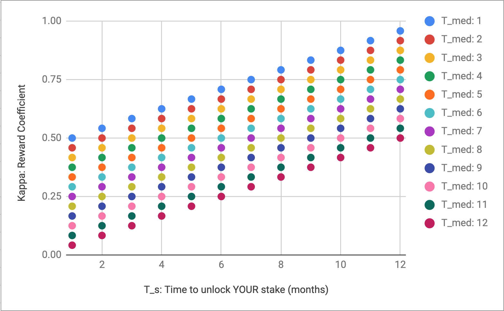

### Using the median staking duration to modify the reward coefficient ###

#### Problem #### 

Currently, stakers choose to lock their NU tokens for a variety of durations, in units of month. The staker earns inflation-based rewards based on the reward coefficient 'kappa', which can be any of 12 discrete figures between 0.54 (1 month lock) and 1.0 (12 months lock) – 0.54, 0.58, 0.63, etc. The longer you stake, the higher your coefficient. 

This coefficient is static with respect to collective choices of other stakers, despite the fact that this has profound effect on the utility of the network, particularly if too many stakers choose short durations (1, 2 months etc).


For the sake of argument, let's say that stakers choose short durations for the following reasons/inclinations: 
1. to protect their assets against risk (e.g. the NU token depreciating)
2. to avoid opportunity costs (e.g. not being able to afford to migrate capital over to another more promising network)
3. to afford real-world short-term spending requirements (e.g. paying for an internet connection).

The actual list of reasons for short term staking is far longer, more complicated, and probably impossible to produce. However, even if our list covered all possible reasons/inclinations, it's clearly very difficult to parameterise the reward coefficient such that it accurately reflects the distribution of stakers and the strength of their inclinations at any given moment. A higher reward coefficient (i.e. extra compensation) for longer staking is specifically intended to counter-act the inclinations/reasons towards shorter staking, but we have no idea how strong those are for each staker, what they're worth, or even what they are.

 This is problematic if we launch the network with parameters mismatch our stakers' inclinations, or indeed if this occurs at any point while the network is live. For example, if the coefficient for longer staking is not enough to persuade a sufficient number of stakers to commit for long periods, this may lead to network users being unable to issue long term sharing policies, particularly if they require larger numbers of independent stakers to faciliate their sharing flow. This may also undermine user confidence in the long-term reliability of the network. An excessive amount of short stake durations can also cause greater token price volatility. 

#### Solution #### 

A solution to this problem is to implement a flexible, self-correcting reward coefficient, driven by staking duration decisions of all network participants. Ideally, we want to legislate against group swings to either extreme (all choosing short durations, all choosing long durations).

Our desired alogorithm will do the following: if a majority of stakers have chosen short durations, the reward coefficient increases for stakers who now choose longer durations, and decreases for stakers who now choose shorter durations. And vice versa.

Note: for simplicity, the reward coefficient should be determined at the moment the staker submits their duration, and stay fixed until the tokens unlock. It would also help stakers a lot if the current median duration of stakes was accessible via the CLI or other staker interface, so they can make an informed decision. 

#### Input variable: T_med #### 

What is the input variable with which to modify the coefficient? There are actually a number of choices here – since stakers can theoretically divide their stake into as many durations as the number of tokens they own, the distribution looks rather complex. However, one approach is to line up all the tokens currently staked, and examine each individual token's duration attribute, or its 'time until unlock'. For now, let’s ignore who owns the token or how long their other tokens are staked for. From this table it is straightforward to derive the median duration of all staked tokens. We will use this variable, T_med, as our input, which will always be in discrete units of month (e.g. T_med = 4 months). 

#### Modifying the reward coefficient: c_kappa #### 

The following function computes a reward coefficient for a stake with a chosen a duration of T_s, where the current median duration of stakes is T_med. 

```sh
small_stake_multiplier = 0.5
T_max = 12

def calc_c_kappa(T_med, T_s):
	if T_s > T_med:
		c_kappa = (min(T_s, T_max) - T_med) / float(T_max * 2) + small_stake_multiplier
	else:
		c_kappa =  (1 + ((min(T_s, T_max) - T_med) / float(T_max))) / 2
	return c_kappa

example_output = calc_c_kappa(T_med = 4, T_s = 11)
print(example_output)
```
This function can be combined with any other function (e.g. the existing kappa calculation) to bias it towards longer or shorter durations, if desired. 

To get a sense of the outputs, here are all the combinatins of T_s and T_med. For example, if the median stake duration is 4 months, and you choose a duration of 11 months, your reward coefficient will be 0.79. If T_s is set 1 month, and T_med is 8 months, you will get the same coefficient (0.79).

|         | T_med: 1 | T_med: 2 | T_med: 3 | T_med: 4 | T_med: 5 | T_med: 6 | T_med: 7 | T_med: 8 | T_med: 9 | T_med: 10 | T_med: 11 | T_med: 12 |
|---------|----------|----------|----------|----------|----------|----------|----------|----------|----------|-----------|-----------|-----------|
| T_s: 1  | 0.50     | 0.46     | 0.42     | 0.38     | 0.33     | 0.29     | 0.25     | 0.21     | 0.17     | 0.13      | 0.08      | 0.04      |
| T_s: 2  | 0.54     | 0.50     | 0.46     | 0.42     | 0.38     | 0.33     | 0.29     | 0.25     | 0.21     | 0.17      | 0.13      | 0.08      |
| T_s: 3  | 0.58     | 0.54     | 0.50     | 0.46     | 0.42     | 0.38     | 0.33     | 0.29     | 0.25     | 0.21      | 0.17      | 0.13      |
| T_s: 4  | 0.63     | 0.58     | 0.54     | 0.50     | 0.46     | 0.42     | 0.38     | 0.33     | 0.29     | 0.25      | 0.21      | 0.17      |
| T_s: 5  | 0.67     | 0.63     | 0.58     | 0.54     | 0.50     | 0.46     | 0.42     | 0.38     | 0.33     | 0.29      | 0.25      | 0.21      |
| T_s: 6  | 0.71     | 0.67     | 0.63     | 0.58     | 0.54     | 0.50     | 0.46     | 0.42     | 0.38     | 0.33      | 0.29      | 0.25      |
| T_s: 7  | 0.75     | 0.71     | 0.67     | 0.63     | 0.58     | 0.54     | 0.50     | 0.46     | 0.42     | 0.38      | 0.33      | 0.29      |
| T_s: 8  | 0.79     | 0.75     | 0.71     | 0.67     | 0.63     | 0.58     | 0.54     | 0.50     | 0.46     | 0.42      | 0.38      | 0.33      |
| T_s: 9  | 0.83     | 0.79     | 0.75     | 0.71     | 0.67     | 0.63     | 0.58     | 0.54     | 0.50     | 0.46      | 0.42      | 0.38      |
| T_s: 10 | 0.88     | 0.83     | 0.79     | 0.75     | 0.71     | 0.67     | 0.63     | 0.58     | 0.54     | 0.50      | 0.46      | 0.42      |
| T_s: 11 | 0.92     | 0.88     | 0.83     | 0.79     | 0.75     | 0.71     | 0.67     | 0.63     | 0.58     | 0.54      | 0.50      | 0.46      |
| T_s: 12 | 0.96     | 0.92     | 0.88     | 0.83     | 0.79     | 0.75     | 0.71     | 0.67     | 0.63     | 0.58      | 0.54      | 0.50      |


