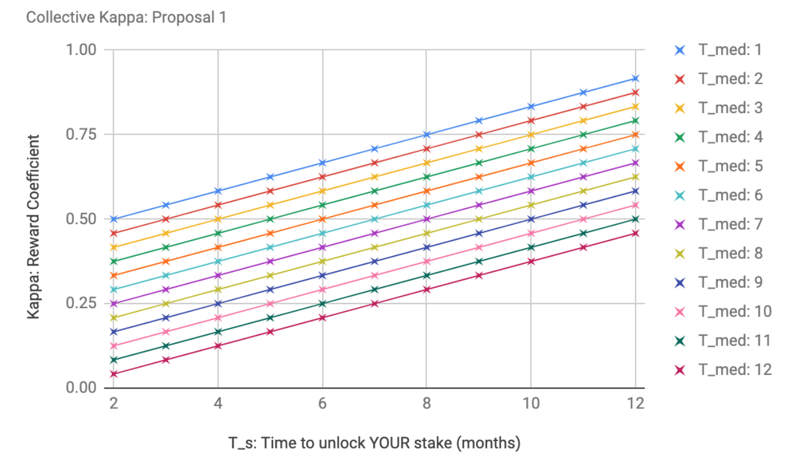

### Using the median staking duration to modify the reward coefficient ###

#### Problem #### 

Currently, stakers choose to lock their NU tokens for a variety of durations, in units of month. The staker's inflation-based rewards are modified by the reward coefficient 'kappa', which can be any of 12 discrete figures between 0.54 (= 1 month lock) and 1.0 (>= 12 months lock) – 0.54, 0.58, 0.63, etc. The longer you commit your stake, the higher the coefficient. 

However, this coefficient is static with respect to the choices of other stakers, despite the fact that their collective choice have a profound effect on the utility of the network, particularly if too many stakers choose short durations (1, 2 months etc).


For the sake of argument, let's say that stakers choose short durations for any of the following three preferences:
1. to protect their assets against risk (e.g. the NU token significantly depreciating while their holding is locked)
2. to minimise opportunity costs (e.g. not being able to afford to migrate capital over to another more promising network)
3. to afford real-world short-term spending requirements (e.g. paying a monthly bill to an ISP).

Obviously, the actual list of preferences (i.e. explanations) for short term staking is longer, more complicated, and probably impossible to exhaustively produce. However, even if our three-point list did cover all possible preferences, it would still be very, very difficult to predict the strength of preference for each amongst a group of stakers at any given moment (as the population of stakers  and individual staker preferences change over time). Although a higher reward coefficient (i.e. extra compensation) for longer staking is specifically designed to counter-act the preference for shorter staking, as designers we have no real idea how strongly those preferences are held by stakers, what they're worth in money terms, or even what all those preferences are. The inability to predict or quantify these preferences means it is far from guaranteed we will parameterize the corresponding reward coefficient correctly in advance.

Launching the network with parameters that mismatch our stakers' preferences is problematic, or indeed if this incongruence occurs at any point while the network is live. For example, if the coefficient for longer staking is not enough to persuade a sufficient number of stakers to commit for long periods, this may lead to network users being unable to issue long term sharing policies, particularly if they require larger numbers of independent stakers to faciliate their sharing flow. This may also undermine user confidence in the long-term reliability of the network. An excessive amount of short stake durations can also cause greater token price volatility. 

#### Solution #### 

A solution to this problem is to implement a flexible, self-correcting reward coefficient, driven by the staking duration decisions of all network participants. Ideally, we want to legislate against group swings to either extreme (majority choosing short durations or majority choosing long durations).

Our desired algorithm will do the following: if a majority of stakers have chosen short durations, the reward coefficient increases for stakers who now choose longer durations, and decreases for stakers who now choose shorter durations. And vice versa. This provides extra incentive to go against the crowd, thereby providing a balancing mechanism. 

Note: to avoid stakers gaming the system, the reward coefficient can be calculated at the moment the staker formally chooses and submits their duration for a given set of tokens, and this will stay fixed at that rate until the tokens unlock. It would also help stakers a lot if the current median duration of stakes was accessible via the CLI or other staker interface, so they can make an informed decision. 

Note: this approach will have an impact on the rate of token release - this needs to be thought about. 

#### Historical Examples #### 

Livepeer's floating inflation rate, determined by the percentage of token-holders 'participating' (bonding tokens to transcoders), is a well-known and innovative attempt to avoid the trap of predefining an economic parameter that mismatches staker behaviour. Here is their algorithm (solidity): 

```sh
function setInflation() internal {
        uint256 currentBondingRate = 0;
        uint256 totalSupply = livepeerToken().totalSupply();
        if (totalSupply > 0) {
            uint256 totalBonded = bondingManager().getTotalBonded();
            currentBondingRate = MathUtils.percPoints(totalBonded, totalSupply);
        }
        if (currentBondingRate < targetBondingRate) {
            // Bonding rate is below the target - increase inflation
            inflation = inflation.add(inflationChange);
        } else if (currentBondingRate > targetBondingRate) {
            // Bonding rate is above the target - decrease inflation
            if (inflationChange > inflation) {
                inflation = 0;
            } else {
                inflation = inflation.sub(inflationChange);
            }
        }
```

One criticism of their approach is this function's reliance on predefining a target bonding rate, which arguably kicks the inflexibility issue from one parameter to another. On the other hand, it is no doubt easier to choose an ideal participation rate (LivePeer sets this to 50%), and add an inflation-correcting mechanism to achieve this, than the exact opposite.


#### Input variable: T_med #### 

What is the input variable with which to modify our reward coefficient? There are actually a number of possibilities here – since stakers can theoretically divide their stake into as many durations as the number of tokens they own, the overall distribution of stake durations is rather complex. However, a simple approach is to line up all the tokens already staked by their individual duration attribute (from 1 to <12). For now, we can ignore who owns the token or how long their other tokens are staked for. From this two-column table it is straightforward to derive the median duration of all staked tokens. We will use this variable, T_med, as our input, which will always be in discrete units of month (e.g. T_med = 4 months). 

#### Modifying the reward coefficient: c_kappa #### 

The following python function computes a reward coefficient for a stake with a chosen a duration of T_s, where the current median duration of stakes is T_med. The output coefficient is normalised between 0 and 1.

```sh
small_stake_multiplier = 0.5
T_max = 12

def calc_c_kappa(T_med, T_s):
	if T_s > T_med:
		c_kappa = (min(T_s, T_max) - T_med) / float(T_max * 2) + small_stake_multiplier
	else:
		c_kappa =  (1 + ((min(T_s, T_max) - T_med) / float(T_max))) / 2
	return c_kappa

example_output = calc_c_kappa(T_med = 4, T_s = 11)
print(example_output)
# 0.791666666667
```
This function can be combined with any other function (e.g. the existing kappa calculation) to bias it towards longer or shorter durations, if desired. 

To get a sense of the outputs, here are all the combinatins of T_s and T_med. For example, if the median stake duration is 4 months, and you choose a duration of 11 months, your reward coefficient will be 0.79. If T_s is set 1 month, and T_med is 8 months, you will get the same coefficient (0.79).

|         | T_med: 1 | T_med: 2 | T_med: 3 | T_med: 4 | T_med: 5 | T_med: 6 | T_med: 7 | T_med: 8 | T_med: 9 | T_med: 10 | T_med: 11 | T_med: 12 |
|---------|----------|----------|----------|----------|----------|----------|----------|----------|----------|-----------|-----------|-----------|
| T_s: 1  | 0.50     | 0.46     | 0.42     | 0.38     | 0.33     | 0.29     | 0.25     | 0.21     | 0.17     | 0.13      | 0.08      | 0.04      |
| T_s: 2  | 0.54     | 0.50     | 0.46     | 0.42     | 0.38     | 0.33     | 0.29     | 0.25     | 0.21     | 0.17      | 0.13      | 0.08      |
| T_s: 3  | 0.58     | 0.54     | 0.50     | 0.46     | 0.42     | 0.38     | 0.33     | 0.29     | 0.25     | 0.21      | 0.17      | 0.13      |
| T_s: 4  | 0.63     | 0.58     | 0.54     | 0.50     | 0.46     | 0.42     | 0.38     | 0.33     | 0.29     | 0.25      | 0.21      | 0.17      |
| T_s: 5  | 0.67     | 0.63     | 0.58     | 0.54     | 0.50     | 0.46     | 0.42     | 0.38     | 0.33     | 0.29      | 0.25      | 0.21      |
| T_s: 6  | 0.71     | 0.67     | 0.63     | 0.58     | 0.54     | 0.50     | 0.46     | 0.42     | 0.38     | 0.33      | 0.29      | 0.25      |
| T_s: 7  | 0.75     | 0.71     | 0.67     | 0.63     | 0.58     | 0.54     | 0.50     | 0.46     | 0.42     | 0.38      | 0.33      | 0.29      |
| T_s: 8  | 0.79     | 0.75     | 0.71     | 0.67     | 0.63     | 0.58     | 0.54     | 0.50     | 0.46     | 0.42      | 0.38      | 0.33      |
| T_s: 9  | 0.83     | 0.79     | 0.75     | 0.71     | 0.67     | 0.63     | 0.58     | 0.54     | 0.50     | 0.46      | 0.42      | 0.38      |
| T_s: 10 | 0.88     | 0.83     | 0.79     | 0.75     | 0.71     | 0.67     | 0.63     | 0.58     | 0.54     | 0.50      | 0.46      | 0.42      |
| T_s: 11 | 0.92     | 0.88     | 0.83     | 0.79     | 0.75     | 0.71     | 0.67     | 0.63     | 0.58     | 0.54      | 0.50      | 0.46      |
| T_s: 12 | 0.96     | 0.92     | 0.88     | 0.83     | 0.79     | 0.75     | 0.71     | 0.67     | 0.63     | 0.58      | 0.54      | 0.50      |





#### Expected Outcomes ####

To be investigated/modelled following team feedback. 

Intuitively, and if staker preferences are evenly distributed from short to long durations (between 1 and 12 months) prior to being presented with this new incentive coefficient, then this approach will push median durations (T_med) to the centre, i.e. around 6 months. From a network point of view, it may be better for T_med to be a longer period than this. It is possible to configure the algorithm such that the 'centre' is pushes behaviour to a target median duration of 12 or 18 months. 

This also demonstrates an advantage that NuCypher has over LivePeer. Their target participation rate of 50% is a little arbitrary – the result of a compromise between two vaguely defined goals (on one had, maximising bonding, and on the other, quote: "the ability to transfer the token, the ability to use it for the main utility of the network, and the ability to use it within ecosystem applications are all reasons not to stake"). In our case, we can choose a target median duration rate as a direct requirement of our adopter/users, reflected in the lengths of their sharing policies. 

